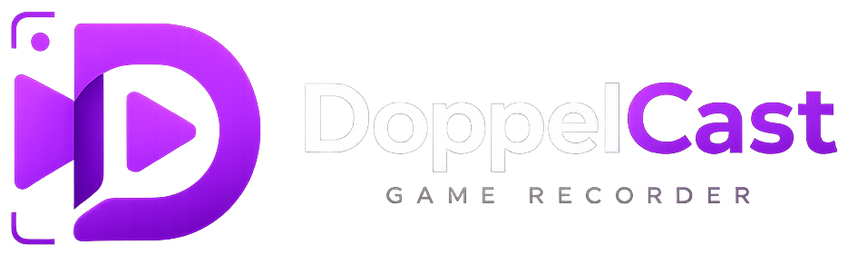

<div align="center">
  

  ### Record Android gameplay on PC without a capture card

  **DoppelCast is a free, open source Android screen recorder for Windows.** It connects to your phone over a standard USB cable and records pixel-perfect gameplay footage straight to your PC — any resolution, any bitrate, any frame rate — with no capture card, no HDMI splitter, and no subscription.

  <br>

  [](LICENSE)
  [](https://github.com/0xramm/DoppelCast/releases/latest)
  [](#installation)
  [](https://github.com/0xramm/DoppelCast/releases)
  <br>
  [](https://github.com/0xramm/DoppelCast/stargazers)
  [](https://github.com/0xramm/DoppelCast/forks)
  [](https://github.com/0xramm/DoppelCast/commits/main)
  [](https://github.com/0xramm/DoppelCast/issues)
  

  [Website](https://0xramm.github.io/DoppelCast/) · [Download](#installation) · [How it works](#how-it-works) · [Features](#features) · [FAQ](#faq) · [Contributing](#contributing)
</div>

---

## Preview

<div align="center">
  
</div>

## What is DoppelCast?

DoppelCast is a Windows application for **recording Android gameplay and screen activity directly to a PC over USB**, without buying a capture card. It's built on top of ADB (Android Debug Bridge), the same USB debugging bridge already built into every Android phone — so there's no driver to install on your device and no proprietary hardware to buy.

People typically reach for DoppelCast when they want to:

- Record mobile gameplay (Free Fire, PUBG Mobile, Call of Duty Mobile, Genshin Impact, and similar titles) for YouTube, TikTok, or Twitch
- Mirror an Android phone to a monitor while capturing the session in full quality
- Avoid the $150–$400 cost of a dedicated capture card just to record a phone screen
- Get full manual control over resolution, frame rate, bitrate, and codec — something most capture card software and freemium mirroring apps lock behind a paywall

## Features

- **Any resolution** — from 480p up to your device's full native resolution
- **Any frame rate** — 30, 60, 90, or 120fps, matched to what your device can output
- **Any bitrate** — from a lightweight 5 Mbps up to broadcast-grade 100+ Mbps (VBR/CBR)
- **H.264 & H.265** — choose the codec that fits your editor or upload target
- **Synced device audio** — captured in sync with video, no separate mic routing
- **Built on ADB, not proprietary drivers** — uses the USB debugging bridge already on your phone
- **No watermark, no ads, no paywall** — every feature is free, always
- **Open source, MIT licensed** — read the code, fork it, or audit it yourself

## How it works

1. **Connect** — Plug your Android device into your PC with a USB cable and enable USB debugging when prompted. DoppelCast detects the device automatically.
2. **Configure** — Set resolution, frame rate, and bitrate independently, from a lightweight 1080p30 clip to a full-bitrate native-resolution capture.
3. **Record** — Hit record. Footage lands on your PC as a ready-to-edit file — no proprietary container, no forced re-encode.

## DoppelCast vs. a capture card

| | Capture card | Freemium mirroring apps | **DoppelCast** |
|---|---|---|---|
| Upfront cost | $150 – $400 | Free tier, then $10–40+ | **$0** |
| Extra hardware | Card, HDMI splitter, drivers | USB cable you already have | **USB cable you already have** |
| Interface | Manufacturer software | Simple GUI | **Simple GUI, nothing to type** |
| Resolution / bitrate | Capped by the card model | Capped on the free tier | **Fully adjustable** |
| Frame rate | Often capped at 60fps | ~30fps on the free tier | **Matches your device's output** |
| Watermark / ads | — | On the free tier | **None** |
| Source code | Closed | Closed | **Open, MIT licensed** |

## Installation

**Requirements:** Windows 10/11 (x64), a USB cable, and an Android device with USB debugging support.

1. Download the latest `DoppelCast.exe` from the [Releases page](https://github.com/0xramm/DoppelCast/releases/latest)
2. Enable **USB debugging** on your Android device (Settings → About phone → tap "Build number" 7 times → Settings → Developer options → USB debugging)
3. Connect your phone to your PC with a USB cable
4. Run `DoppelCast.exe` — no installer required

Or build from source:

```bash
git clone https://github.com/0xramm/DoppelCast.git
cd DoppelCast
./DoppelCast.exe
```

Every release is scanned on VirusTotal before publishing, and SHA-256 checksums are published on each [release page](https://github.com/0xramm/DoppelCast/releases) so you can verify the download yourself.

## FAQ

**Is DoppelCast really free?**
Yes. DoppelCast is free and open source under the MIT license, with no watermark, no ad-supported tier, and no paid "pro" version.

**Do I need a capture card to record Android gameplay?**
No. DoppelCast reads the video signal directly from your Android device over USB using ADB, so a physical capture card and HDMI splitter aren't required.

**What's the maximum resolution and frame rate I can record at?**
DoppelCast records up to your device's native display resolution, at up to 120fps depending on what your device and game can output.

**Does DoppelCast work on Mac or Linux?**
The current release targets Windows 10/11. Cross-platform support depends on community contributions — see [Contributing](#contributing) if you'd like to help.

**Do I need to install anything on my Android phone?**
No separate app is required. DoppelCast uses ADB (USB debugging), which is a built-in developer feature on every Android device — you only need to enable it once in Developer options.

**Is my recording sent anywhere online?**
No. Recording happens entirely locally between your device and your PC over USB. DoppelCast doesn't upload footage anywhere.

**Why does my phone need USB debugging enabled?**
USB debugging is what allows a PC to communicate with an Android device over ADB. It's the same permission used by Android Studio and other development tools, and it can be turned off again in Developer options at any time.

## Contributing

Issues and pull requests are welcome. If you're planning a larger change, please open an issue first to discuss what you'd like to change.

```bash
git clone https://github.com/0xramm/DoppelCast.git
cd DoppelCast
npm install
```

This project is built with Tauri, React, and TypeScript.

## Star History

<a href="https://star-history.com/#0xramm/DoppelCast&Date">
  
</a>

## License

DoppelCast is released under the [MIT License](LICENSE).

## Disclaimer

DoppelCast is an independent, community-built project and is not affiliated with, endorsed by, or sponsored by Google or the Android trademark owner.
